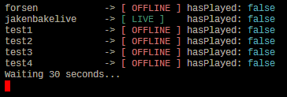

# Twitch Live Watcher
Simple go app to play generated TTS (Text-to-Speech) when a twitch channel goes live.   

 
#### Dependencies
1. github.com/ebitengine/oto/v3
2. github.com/hajimehoshi/go-mp3
3. streamelements tts
## How-to
watchlist inside streams.txt  
tts whitelist inside tts.txt  
## Todo
1. Pre-generate TTS for channels
2. Add functionality for offline TTS generation using Piper maybe
